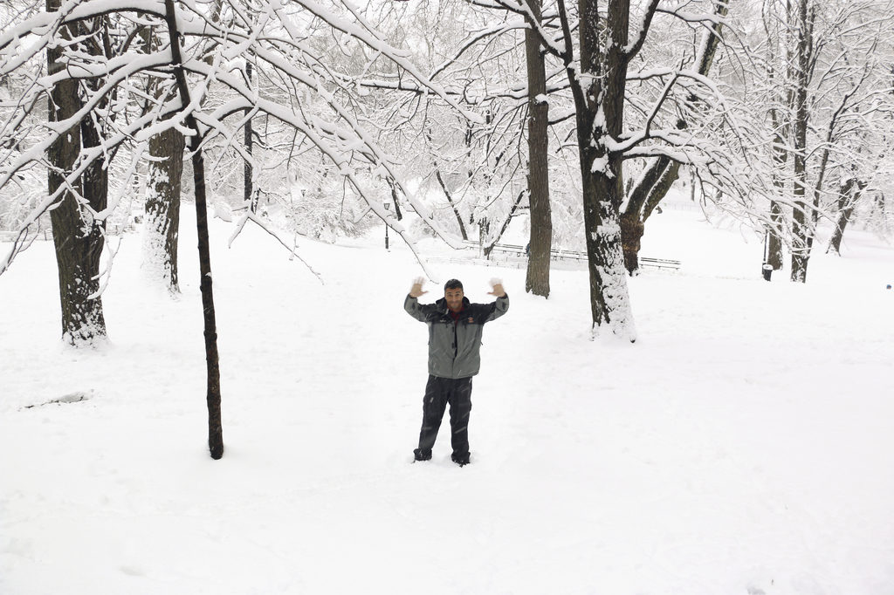

# Hello! I am Victor Alves.

Born and raised in Brazil, I now spend my days in the Netherlands with my wife
and daughters.

I have been a software developer for more than two decades. I enjoy working out
the solution for technical problems with the tool at hand. And mastering the
craft of developing good software, whatever that means.

I have spent my entire career writing software in several programming languages
for a few different industries and I will probably continue to do it so for
some time. You can check my [resume](http://bit.ly/vhugo_resume) or
[Linkedin](https://linkedin.com/in/vhugoalves) profile for more information.
